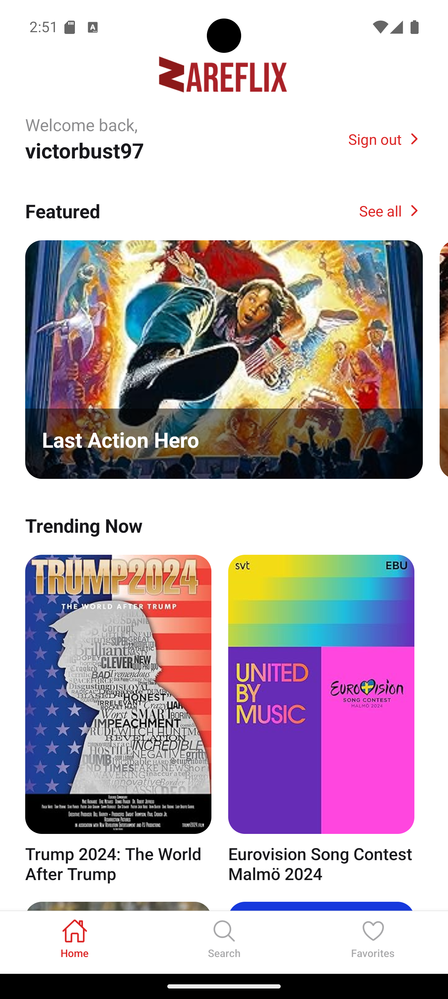
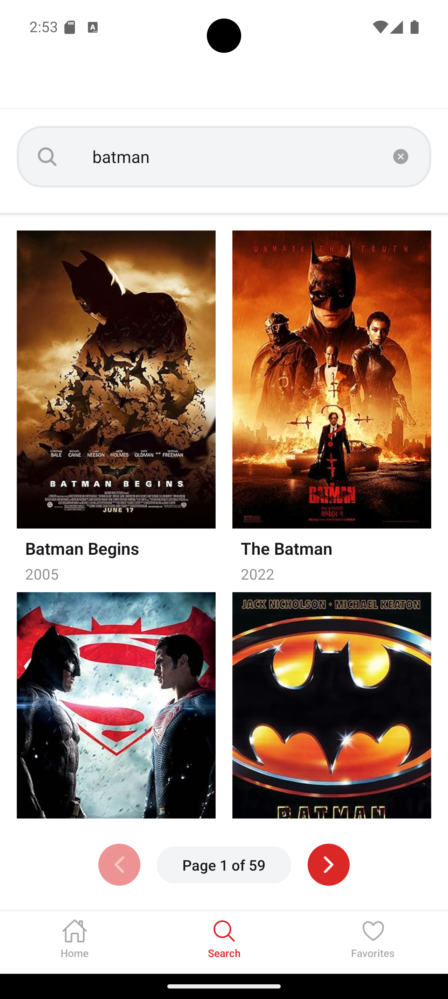
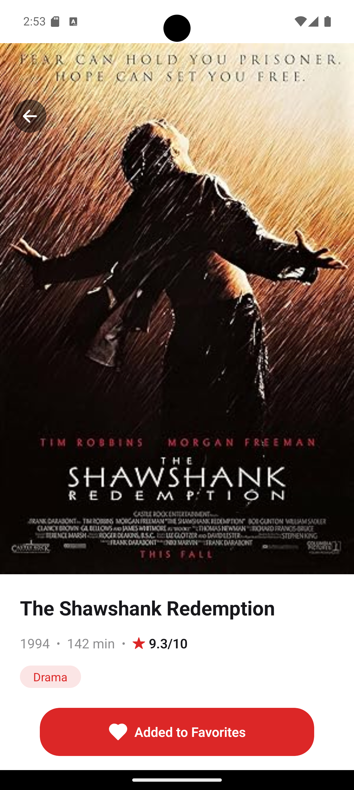
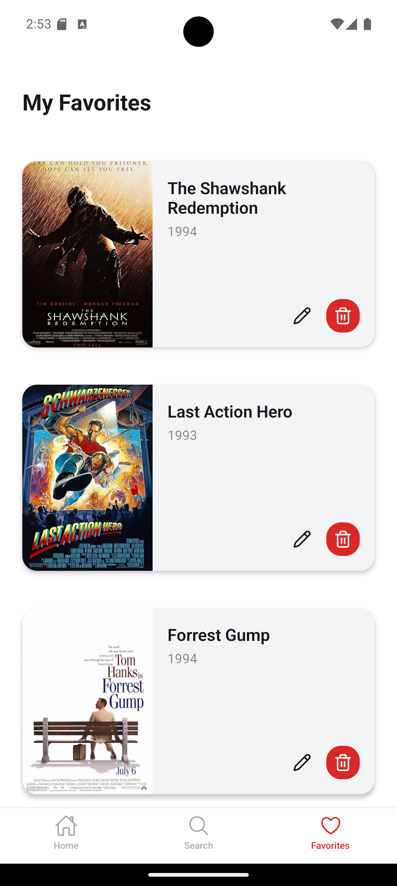

<div align="center">
  <h1>🎬 ZareFlix Native</h1>
  <p>A React Native movie discovery app built with Expo</p>
</div>

## 📱 Features

- **Movie Discovery**: Browse and search through a vast collection of movies
- **Authentication**: Secure user authentication with Clerk
- **Favorites**: Save and manage your favorite movies
- **Movie Details**: Get comprehensive information about any movie
- **Personalized Content**: Featured and trending movies sections
- **Smart Search**: Real-time movie search with debouncing

## 🛠 Tech Stack

- **Expo** - React Native framework
- **React Query** - Data fetching & caching
- **Clerk** - Authentication
- **OMDB API** - Movie database
- **TypeScript** - Type safety
- **Expo Router** - File-based routing

## 🚀 Getting Started

### Prerequisites

- Node.js >= 18
- npm or yarn
- Expo CLI
- iOS Simulator or Android Emulator (optional)

### Environment Variables

Create a `.env` file in the root directory:

```env
EXPO_PUBLIC_OMDB_API_KEY=your_omdb_api_key
EXPO_PUBLIC_CLERK_PUBLISHABLE_KEY=your_clerk_key
EXPO_PUBLIC_API_URL=your_api_url
```

## Installation

1. Clone the repo

```bash
git clone https://github.com/yourusername/zareflix-native.git
```

2. Install dependencies

```bash
npm install
```

3. Start the dev server

```bash
npm start
```

4. Run on the different platforms

```bash
# iOS
npm run ios

# Android
npm run android

# Web
npm run web
```

## 📁 Project Structure

```bash
ZareFlix/
├── app/                    # App screens and navigation
│   ├── (auth)/            # Authentication screens
│   ├── (movies)/          # Movie-related screens
│   └── movie/             # Movie details screen
├── components/            # Reusable components
│   ├── ui/               # Basic UI components
│   └── features/         # Feature-specific components
├── constants/            # App constants and theme
├── hooks/               # Custom React hooks
├── services/           # API and external services
└── types/              # TypeScript type definitions
```

## 📱 Screenshots

<div style="display: flex; gap: 10px;"> 
   
   
   
   
</div>
